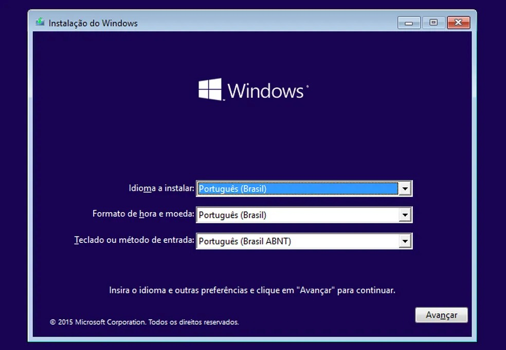

# 🖥️ Suporte Técnico e Manutenção de Computadores

## 📌 Sobre o projeto

Este repositório reúne conhecimentos e procedimentos práticos relacionados a **suporte técnico, manutenção, configuração, diagnóstico e otimização de computadores**.

O objetivo é documentar processos utilizados para identificar problemas, realizar configurações e preparar computadores para utilização.

---

## 🛠️ Áreas de atuação

### 💿 Formatação e instalação

* Preparação do computador;
* Instalação do Windows;
* Configuração inicial;
* Instalação de drivers;
* Instalação de softwares;
* Testes após a instalação.

[Ver documentação →](documentacao/formatacao-windows.md)

### ⚙️ Configuração

* Configuração do sistema operacional;
* Instalação e atualização de drivers;
* Configuração de softwares;
* Verificação de dispositivos;
* Testes de funcionamento.

[Ver documentação →](documentacao/instalacao-configuracao.md)

### ⚡ Otimização

* Análise de desempenho;
* Verificação do uso de CPU e memória;
* Análise de programas de inicialização;
* Limpeza e organização do sistema;
* Verificação de atualizações;
* Testes após as otimizações.

[Ver documentação →](documentacao/otimizacao-pc.md)

---

## 🔎 Processo de diagnóstico

Para problemas de desempenho ou funcionamento, o processo pode envolver:

```text
Problema
   ↓
Análise inicial
   ↓
Identificação da possível causa
   ↓
Aplicação da solução
   ↓
Testes
   ↓
Validação do resultado
```

O objetivo é buscar a causa do problema antes de realizar alterações desnecessárias.

---

## 🖼️ Demonstrações

### Formatação e instalação



### Configuração


### Otimização


---

## 🧠 Competências demonstradas

* Suporte técnico
* Diagnóstico de problemas
* Manutenção de computadores
* Windows
* Instalação e configuração de software
* Instalação de drivers
* Otimização de desempenho
* Manutenção preventiva

---

## 📚 Documentação

| Documento                                                            | Conteúdo                           |
| -------------------------------------------------------------------- | ---------------------------------- |
| [Formatação e instalação](documentacao/formatacao-windows.md)        | Processo de instalação do Windows  |
| [Instalação e configuração](documentacao/instalacao-configuracao.md) | Configuração do computador         |
| [Otimização](documentacao/otimizacao-pc.md)                          | Análise e otimização de desempenho |

---

## 🎯 Objetivo profissional

Utilizar este projeto como demonstração prática dos conhecimentos desenvolvidos na área de **Suporte Técnico e Tecnologia da Informação**.
