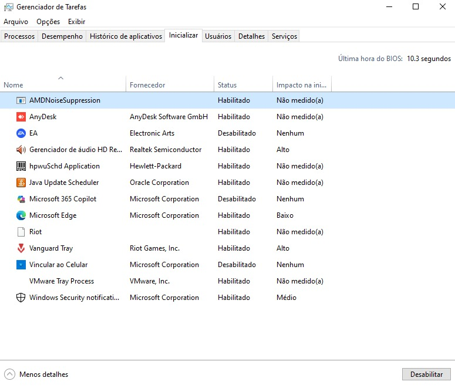
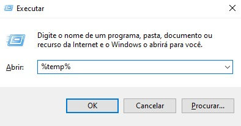
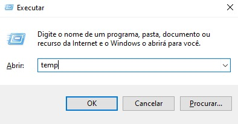
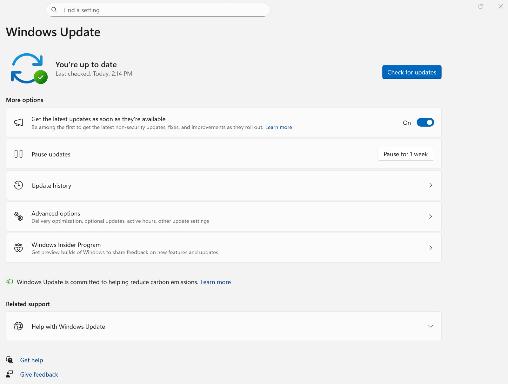

⚡ Otimização de Computadores
📌 Objetivo

Documentar procedimentos utilizados para identificar possíveis causas de lentidão e melhorar o desempenho de computadores.

1. Análise inicial

Antes de realizar alterações, é importante verificar o estado atual do computador.

Verificações
Uso do processador.
Uso da memória RAM.
Espaço disponível no armazenamento.
Programas em execução.
Programas iniciados com o Windows.

2. Programas de inicialização

É realizada uma análise dos programas configurados para iniciar automaticamente com o sistema.

🖼️ Demonstração

3. Limpeza e organização

São realizadas verificações para identificar arquivos temporários que existe nas pastas %temp%, temp, prefetch e outros elementos desnecessários que possam ocupar espaço no armazenamento.

🖼️ Demonstração

4. Atualizações

É realizada a verificação das atualizações disponíveis para o sistema operacional e, quando necessário, para drivers e softwares.

🖼️ Demonstração

5. Verificação após a otimização

Após os procedimentos, são realizados novos testes para verificar o comportamento do computador.

✅ Resultado

O objetivo da otimização é melhorar a estabilidade e o desempenho do computador, mantendo o sistema adequado para utilização.

📚 Conhecimentos demonstrados
Análise de desempenho
Windows
Manutenção preventiva
Gerenciamento de recursos
Diagnóstico de problemas
Otimização de sistemas
